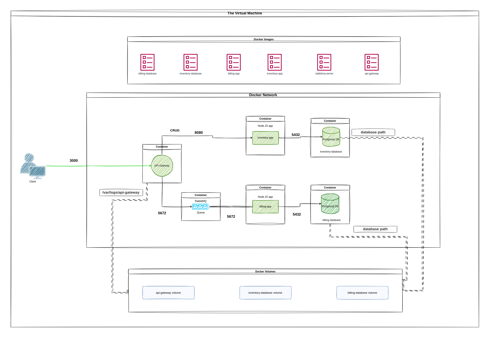

## play-with-containers

### Overview

This project introduces containerization concepts and provides hands-on experience by building a microservices architecture using Docker and Docker Compose. You will deploy multiple services, connect them through networks and volumes, and ensure they run reliably in isolated containers. The project also emphasizes best practices for building Docker images and orchestrating multi-container applications.

### Learning Objectives

- Design a multi-container microservices architecture using Docker and Docker Compose.
- Implement isolated services with PostgreSQL databases, RabbitMQ messaging, and an API Gateway.
- Configure Docker networks and volumes to manage inter-service communication and persistent data.
- Optimize Dockerfiles and container builds for performance and maintainability.
- Document the project setup, configuration, and usage clearly in a README.md.

### Instructions

You must install Docker on your Linux virtual machine. Docker will also be required during the audit.

You have to implement this architecture:

You will use the services described in the `crud-master` project as the base for this architecture.
[Here](https://github.com/01-edu/crud-master-py) is a working solution that you can use to solve this project.

You are required to create a `Dockerfile` for each service and call them in
your `docker-compose.yml` (each service should have its own container for optimal
performance.). To ensure performance, the containers should be created from the latest stable version minus one (penultimate) of either `Alpine` or `Debian`, depending on your
preference. The corresponding service and Docker image must share the same
name. This implies that you must build your project's Docker images, and you are
not allowed to use pre-built Docker images or services like Docker Hub, except
for `Alpine` and `Debian`.

#### Docker Containers:

- The `inventory-db` container is a PostgreSQL database server that contains the
  inventory database. It must be accessible via port `5432`.
- The `billing-db` container is a PostgreSQL database server that contains the
  billing database. It must be accessible via port `5432`.
- The `inventory-app` container is a server that contains the
  inventory-app. It will be connected to the inventory database and accessible
  via port `8080`.
- The `billing-app` container is a server that contains the billing-app.
  It will be connected to the billing database and will consume messages from
  the RabbitMQ queue. It will be accessible via port `8080`.
- The `rabbit-queue` container is a RabbitMQ server that contains the queue.
- The `api-gateway-app` container is a server that contains the
  API gateway. It will forward the requests to the other services, and it is
  accessible via port `3000`.

> Containers must automatically restart in case of failure.

#### Docker Volumes:

- `inventory-db` volume contains your inventory database.
- `billing-db` volume contains your billing database.
- `api-gateway-app` volume contains your API gateway logs.

#### Docker Network:

- You must have a Docker network that establishes the connection between all
  services inside your Docker host.
- Any external request must be able to access only the `api-gateway-app` via
  port `3000`.

> All resources in your infrastructure must be targeted and managed by
> docker-compose.

> You don't have to push your credentials and passwords to your repo, the
> credentials and passwords must be in the `.env` file, and this file must be
> ignored in the `.gitignore` file.

> Don't push your passwords to Git, unless you want to throw a thief's party
> with free drinks and no bouncers on duty!

### Documentation

You must provide a `README.md` file containing full documentation of your solution
(prerequisites, configuration, setup, usage, etc.).

### Bonus

Use your `crud-master` services for the solution of this project.

If you complete the mandatory part successfully, and you still have free time,
you can implement anything that you feel deserves to be a bonus.

Challenge yourself!

### Key concepts

- `Containers` are units of software that packages code and its dependencies,
  so the application runs quickly and reliably across computing environments.
- `Docker` is a set of platform-as-a-service products that use OS-level
  virtualization to deliver software in packages called containers.
- `Dockerfile` is a text document that contains all the commands a user could
  call on the command line to assemble an image.
- `Docker Images` are read-only templates that contain a set of instructions for creating a container that can run on the Docker platform.
- `Docker Networks` enable a user to connect a Docker container to one or more networks.
- `Docker Volumes` are the preferred mechanism for persisting data
  generated and used by Docker containers.
- `Docker Compose` is a tool for defining and running multi-container
  Docker applications. With Compose, you use a YAML file to configure your
  application's services.

### Tips

- Spend time on the theory before rushing into the practice.
- Read the official documentation of Docker.

> Any lack of understanding of the concepts of this project may affect the
> difficulty of future projects, take your time to understand all concepts.

> Be curious and never stop searching!

> Each operation in Dockerfile is a layer in the image, You must design it
> appropriately to avoid duplicate or useless layers in the image.

> It is not recommended to use `latest` in your Dockerfile; instead, specify an explicit version tag.

### Submission and audit

You must submit the `README.md` file and all files used to create, delete and
manage your infrastructure: docker-compose, Dockerfiles, scripts and so on.

> The infrastructure must be able to be created, deleted, and managed only by
> `docker-compose`. In the audit you will be asked different questions about
> the concepts and the practices of this project, prepare yourself!